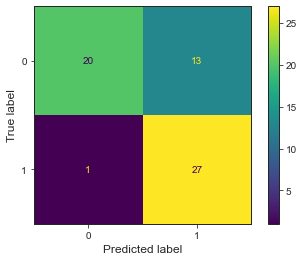
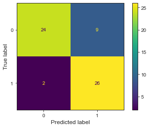
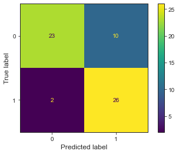
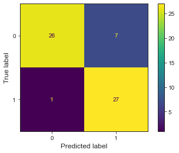

# Project Report :
## Heart Disease Prediction using multiple Machine Learning Classifiers
* In this mini-project, I've trained multiple models on a small dataset [(Link)](https://www.kaggle.com/ronitf/heart-disease-uci) to identify if a person has a heart disease or not.
* The following machine learning models were trained in this project :
	* Decision Tree
	* Random Forest 
	* Support Vector Machine with a Polynomial Kernel
	* K-nearest neighbors
	* Logistic Regression
	* Naive Bayes
	* Hard Voting based Ensemble
* The dataset of 303 examples was split into 242 training examples (80%) & 61 test examples (20%).
* Evaluation Metrics used for determining model accuracy - Accuracy Score & F1 Score.
* Hyperparameters for the first 6 models (as listed above) were tuned via 10-fold cross validation using GridSearchCV.
* For the Ensemble-based model, a Hard Voting Ensemble Classifier was implemented using Logistic Regression, Support Vector Machine with a Gaussian RBF Kernel, Decision Tree & Random Forest Classifiers.
* Model performance details : 

    | Serial No. |                      Model                      | Accuracy Score on Training Set | Accuracy Score on Test Set | F1 Score on Test Set |                Confusion Matrix evaluated on Test Set (61 samples)                |
    |:----------:|:-----------------------------------------------:|:------------------------------:|:--------------------------:|:--------------------:|:---------------------------------------------------------------------------------:|
    |     1.     |                  Decision Tree                  |               83%              |             77%            |          79%         |                     |
    |     2.     |                  Random Forest                  |               86%              |             84%            |          84%         |                     |
    |     3.     | Support Vector Machine with a Polynomial Kernel |               93%              |             82%            |          83%         |                                        |
    |     4.     |               K-nearest neighbors               |               91%              |             84%            |          84%         |                                        |
    |     5.     |               Logistic Regression               |               88%              |             84%            |          84%         |         |
    |     6.     |                   Naive Bayes                   |               87%              |             80%            |          81%         |                         |
    |     7.     |            Hard Voting Ensemble Model           |               99%              |             87%            |          87%         |  |

#### Results :
The **Hard Voting Ensemble Model** has the highest out-of-sample accuracy score of 0.87 as well as highest F1 score of 0.87 whereas the Decision Tree Model has the lowest out-of-sample accuracy score of 0.77 as well as lowest F1 score of 0.79. 

>*Note : Because of the small size of the dataset, a better test-set performance couldn't be attained. Also, a small dataset puts a constraint on the test-set size, which in turn prevents us from getting an accurate estimation on our out-of-sample evaluation metrics which actually help us estimate how our models will perform in the real world.*
